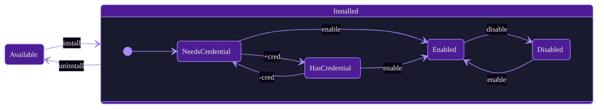

# agentOS Plugins

Open-source plugin definitions for [agentOS](https://github.com/jcontini/agentos).

Plugins teach AI agents how to use your apps and APIs — they're markdown files with configuration and documentation.

## Core Concepts

```mermaid
%%{init: {'theme': 'dark', 'themeVariables': { 'fontSize': '16px', 'fontFamily': 'ui-monospace, monospace', 'lineColor': '#6b7280', 'primaryTextColor': '#f3f4f6', 'edgeLabelBackground': '#1a1a2e' }}}%%
flowchart LR
    subgraph Container[" "]
        direction LR
        Sources(["📦 Sources"]) -->|provide| Plugins(["⚡ Plugins"])
        Agents(["🤖 Agents"]) -->|use| Actions(["⚙️ Actions"])
        Plugins -->|define| Actions
        Actions -->|produce| Activities(["📋 Activities"])
        Plugins -->|have| Credentials(["🔑 Credentials"])
    end
    
    style Container fill:#1a1a2e,stroke:#4a4a6a,stroke-width:2px,rx:10,ry:10
    style Sources fill:#134e4a,stroke:#14b8a6,stroke-width:2px,color:#ccfbf1
    style Plugins fill:#4c1d95,stroke:#a78bfa,stroke-width:2px,color:#f3f4f6
    style Agents fill:#78350f,stroke:#f59e0b,stroke-width:2px,color:#fef3c7
    style Actions fill:#7c2d12,stroke:#f97316,stroke-width:2px,color:#ffedd5
    style Activities fill:#374151,stroke:#9ca3af,stroke-width:2px,color:#f3f4f6
    style Credentials fill:#064e3b,stroke:#10b981,stroke-width:2px,color:#d1fae5
    
    linkStyle 0 stroke:#14b8a6,stroke-width:2px
    linkStyle 1 stroke:#f59e0b,stroke-width:2px
    linkStyle 2 stroke:#a78bfa,stroke-width:2px
    linkStyle 3 stroke:#f97316,stroke-width:2px
    linkStyle 4 stroke:#10b981,stroke-width:2px
```



| Entity | Description |
|--------|-------------|
| **Sources** | Repositories that provide plugins (GitHub, local folder) |
| **Plugins** | Integrations with apps and APIs |
| **Agents** | AI assistants (Claude, Cursor, Windsurf) |
| **Actions** | Operations a plugin can perform |
| **Activities** | Log of every action execution |
| **Credentials** | API keys, tokens stored per plugin (supports multiple: Personal, Work) |

### Plugin Lifecycle



### Actions

Operations a plugin can perform. Two modes:

| Mode | When | AI Behavior |
|------|------|-------------|
| `readonly: true` | Read operations | Executes immediately |
| `readonly: false` | Write operations | Shows preview, requires `confirmAction: true` |

Naming convention: `get_*`, `create_*`, `update_*`, `delete_*`, `search`

### Credentials

All plugins support multiple named credentials (Personal, Work, AgentOS, etc.). When multiple credentials exist for a plugin, the AI must specify which to use via the `account` parameter.

## What's a Plugin?

A plugin is a markdown file (`plugins/{id}/plugin.md`) with:
- **YAML frontmatter** — metadata, auth config, action definitions
- **Markdown body** — instructions the AI reads to use the plugin

Most plugins are just this single file. Complex plugins (like `browser/`) can include a `scripts/` folder for additional logic.

```yaml
---
id: todoist
name: Todoist
description: Personal task management
tags: [tasks, productivity]
icon: https://cdn.simpleicons.org/todoist

auth:
  type: api_key
  header: Authorization
  prefix: "Bearer "

actions:
  get_tasks:
    readonly: true
    api:
      method: GET
      url: https://api.todoist.com/rest/v2/tasks
  
  create_task:
    api:
      method: POST
      url: https://api.todoist.com/rest/v2/tasks
---

# Todoist

Instructions for AI go here...
```

## Using Plugins

1. Open agentOS → Plugins
2. Browse and install a plugin
3. Add credentials if required
4. AI agents can now use it via MCP

## Development Setup

```bash
git clone https://github.com/agentos/agentos-plugins
cd agentos-plugins
./setup.sh  # Configures security hooks
```

The setup script enables pre-commit hooks that block insecure patterns:
- `$AUTH_TOKEN` exposure
- `curl`/`wget` usage (use `rest:` or `http:` blocks instead)
- Bearer token interpolation

## Contributing

See **[CONTRIBUTING.md](CONTRIBUTING.md)** for the complete guide:
- Plugin schema and all fields
- Action types (REST, GraphQL, Shell)
- Authentication options
- AI-first design best practices
- Testing and validation

## License

MIT
